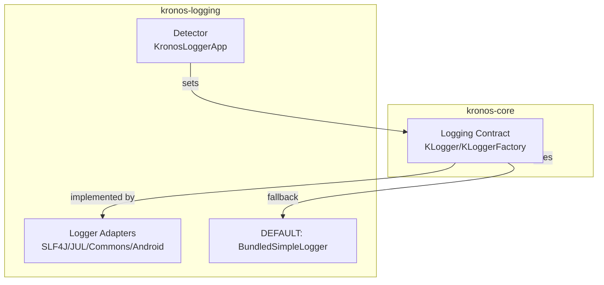

# Kronos Logging Developer Guide

This document introduces the kronos-logging module: purpose, key classes, adapters, configuration and examples. It complements the logging domain overview in kronos-core and focuses on the dedicated logging adapters and auto-detection logic.

Who is this for:
- Users who want structured, colored SQL logs and to plug Kronos into existing logging stacks (SLF4J, JUL, Apache Commons, Android Log);
- Contributors who want to implement a new KLogger adapter.

## 1. Module Overview
- Provides implementations of the lightweight logging contract defined in kronos-core (KLogger and KLoggerFactory).
- Offers several adapters via reflection to avoid hard dependencies:
  - Android Log, Apache Commons Logging, java.util.logging (JUL), SLF4J, plus the bundled simple console/file logger.
- Auto-detection: kronos-logging detects an available backend at startup in typical setups; the helper KronosLoggerApp.detectLoggerImplementation() exists for explicit control, but manual invocation is not required.

Detailed docs:
- EN: [sections/en/01-overview.md](./sections/en/01-overview.md)
- 中文: [sections/zh_CN/01-模块定位与简介.md](./sections/zh_CN/01-模块定位与简介.md)

## 2. Layout and Key Classes
- com.kotlinorm.KronosLoggerApp: auto-detects and sets the logger; builds KLogger instances based on Kronos.loggerType.
- com.kotlinorm.adapter.*: concrete adapters for popular logging systems:
  - AndroidUtilLoggerAdapter
  - ApacheCommonsLoggerAdapter
  - JavaUtilLoggerAdapter
  - Slf4jLoggerAdapter
- Bundled simple logger (implementation lives in kronos-core: com.kotlinorm.beans.logging.BundledSimpleLoggerAdapter) used as DEFAULT_LOGGER.
- Exception: com.kotlinorm.exceptions.KotoNoLoggerException

Detailed docs:
- EN: [sections/en/02-layout-and-key-classes.md](./sections/en/02-layout-and-key-classes.md)
- 中文: [sections/zh_CN/02-目录结构与关键类.md](./sections/zh_CN/02-目录结构与关键类.md)

## 3. Configuration and Usage
- Set preferred logger type via Kronos.loggerType (enum KLoggerType): ANDROID_LOGGER, COMMONS_LOGGER, JDK_LOGGER, SLF4J_LOGGER, DEFAULT_LOGGER, NONE.
- Or call KronosLoggerApp.detectLoggerImplementation() to choose the first available implementation at runtime.
- Provide factory: Kronos.defaultLogger = { clazzOrTag -> ... returns KLogger }
- For bundled logger, control behavior via:
  - BundledSimpleLoggerAdapter.traceEnabled/debugEnabled/infoEnabled/warnEnabled/errorEnabled
  - BundledSimpleLoggerAdapter.logPath (from Kronos.logPath): e.g. set to ["console"] or ["/var/log/app"]

Examples and more:
- EN: [sections/en/03-configuration-and-usage.md](./sections/en/03-configuration-and-usage.md)
- 中文: [sections/zh_CN/03-配置与使用.md](./sections/zh_CN/03-配置与使用.md)

## 4. Relationship to kronos-core
- kronos-core depends only on the logging contract (interfaces KLogger/KLoggerFactory) and logs via utils in TaskUtil (handleLogResult/logAndReturn).
- This module provides drop-in adapters; core emits structured messages (KLogMessage) to the chosen KLogger.

## 5. Mermaid: Integration Snapshot

## 6. DSL & Design
- EN: [sections/en/04-dsl-and-design.md](./sections/en/04-dsl-and-design.md)
- 中文: [sections/zh_CN/04-DSL与设计.md](./sections/zh_CN/04-DSL与设计.md)

## 7. Contributing
- Add new adapters under com.kotlinorm.adapter following KLogger contract.
- Ensure reflective access to avoid hard compile-time deps where possible.
- Provide minimal tests/examples in kronos-testing.
