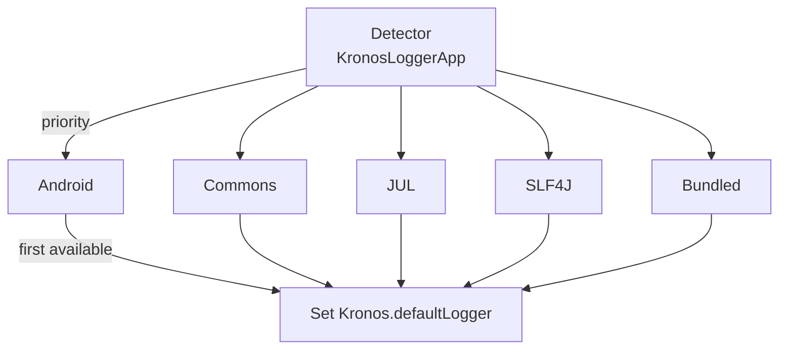
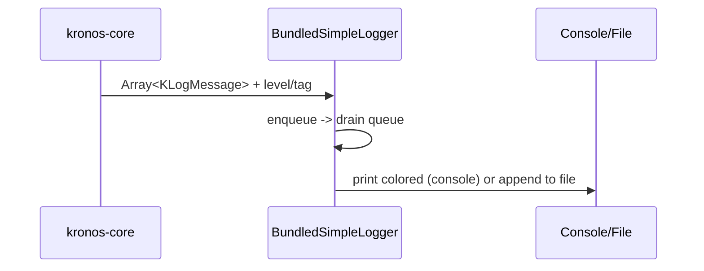

# 4. Logging DSL and Design Rationale

This chapter explains how Kronos structures log messages, why the API uses arrays, and how detection, adapters, and the bundled logger work together. Diagrams and examples are provided.

## 4.1 The Logging DSL (KLogMessage/KLogMessageBuilder)

Core types (in kronos-core):
- KLogMessage: a single log fragment with optional style codes (color/bold/etc.) and an optional newline flag.
- KLogMessageBuilder: a small DSL to compose an Array<KLogMessage> using intuitive operators.

Key operators:
- "-\"text\"": append a fragment without newline.
- "+\"text\"": append a fragment with newline.
- "\"text\"[code1, code2]": apply styles (colors/background/styles) to a fragment.
- Same operators also work for KLogMessage or Array<KLogMessage> values.

Example:
```kotlin
import com.kotlinorm.beans.logging.log
val messages = log {
    -"[SQL] "[bold]
    -"select * from user where id = ? "
    +"args: [1]"[cyan]
}
```
This produces an Array<KLogMessage> consumed by KLogger methods.

## 4.2 Why the API accepts arrays

- Structured composition: A log line is often naturally made of multiple fragments (prefix, SQL, args, metrics). Arrays preserve the structure until the adapter renders it.
- Style-aware formatting: Each fragment can have its own styles. Arrays allow adapters to re-map or ignore styles according to their backend capability.
- Zero cost when disabled: KLogger implementations check isXEnabled() first; arrays can be built lazily or cheaply. Adapters can efficiently join fragments only when needed.
- Backend interoperability: Some backends (e.g., SLF4J/JUL/Commons/Android) prefer a single formatted string; others (like the bundled logger) can print fragments with colors. Arrays let kronos-logging convert appropriately per adapter.

## 4.3 Detection and selection mechanism

- Typical behavior: kronos-logging auto-detects a suitable backend at startup if present; otherwise falls back to the bundled simple logger.
- Optional helper: KronosLoggerApp.detectLoggerImplementation() exists to trigger detection explicitly (e.g., if you need to control the timing). Most users do not need to call it.
- Override: You may override Kronos.loggerType and Kronos.defaultLogger to force a specific backend.

Mermaid (detection snapshot):


Priority note: the built-in detector tries Android -> Commons -> JDK(JUL) -> SLF4J -> Bundled (default). If a class is missing, it silently skips to the next.

## 4.4 How adapters render messages

- All adapters implement KLogger and receive Array<KLogMessage>.
- External backends (SLF4J/JUL/Commons/Android): messages are joined to a single formatted string (KLogMessage.formatted()), passed to the backend with an optional Throwable.
- BundledSimpleLoggerAdapter (in kronos-core):
  - Adds timestamp, level, and tag.
  - Renders styled fragments with ANSI codes on console; or writes plain text to file.
  - Async queue with a lightweight lock to flush messages to console and/or files.
  - Controlled by flags (trace/debug/info/warn/error) and logPath (e.g., ["console"], ["/var/log/app"]).

Mermaid (bundled logger flow):


## 4.5 Where logs come from in core

kronos-core emits structured logs around task execution via utilities (e.g., TaskUtil.handleLogResult/logAndReturn). The messages include:
- Task type (query/update/batch), SQL, bound parameters (filtering null), affected rows or result size;
- Extra info such as lastInsertId (with plugin support).

Example (conceptual; with `import com.kotlinorm.beans.logging.log` in scope):
```kotlin
Kronos.defaultLogger(this).info(
    log {
        -"[query] "[green]
        -sql
        +" args: ${'$'}{params.contentToString()}"[cyan]
    }
)
```

## 4.6 Summary

- DSL builds an Array<KLogMessage> offering structured, style-aware logging.
- Arrays enable adapter-agnostic rendering and efficient disabled-level behavior.
- Detection is automatic in typical usage; manual invocation is optional.
- The bundled logger provides ergonomic colored console/file output without external dependencies.
