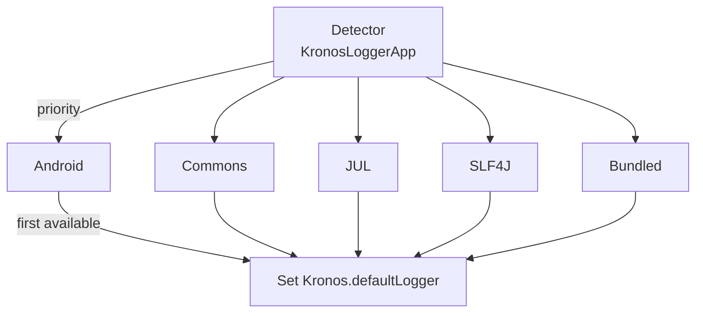
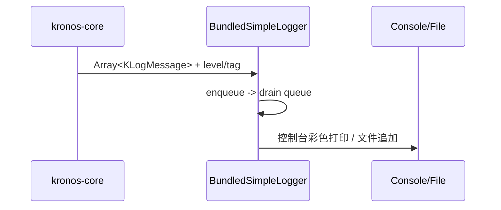

# 4. 日志 DSL 与设计原理

本章节介绍 Kronos 的日志消息组织方式、为何 API 接受数组、以及自动探测、适配器与内置 Logger 的工作机制，并配以示例与图示。

## 4.1 日志 DSL（KLogMessage/KLogMessageBuilder）

核心类型（位于 kronos-core）：
- KLogMessage：单个日志片段，带可选样式码（颜色/加粗等）与换行标记；
- KLogMessageBuilder：用直观操作符组合 Array<KLogMessage> 的小型 DSL。

关键操作符：
- "-\"text\""：追加片段（不换行）；
- "+\"text\""：追加片段（换行）；
- "\"text\"[code1, code2]"：为片段应用样式（颜色/背景/风格）；
- 同样操作也适用于 KLogMessage 或 Array<KLogMessage> 值。

示例：
```kotlin
import com.kotlinorm.beans.logging.log
val messages = log {
    -"[SQL] "[bold]
    -"select * from user where id = ? "
    +"args: [1]"[cyan]
}
```
上述 DSL 会产出 Array<KLogMessage>，供 KLogger 的方法消费。

## 4.2 为什么 API 接受数组

- 结构化组合：一条日志往往天然由多个片段构成（前缀、SQL、参数、指标等），数组在渲染前保留结构；
- 样式感知：不同片段可应用各自样式，数组便于适配器按后端能力映射/忽略样式；
- 级别禁用时零额外开销：实现会先检查 isXEnabled()；数组构造可以很轻量，仅在需要时再合并字符串；
- 后端互操作：外部后端（SLF4J/JUL/Commons/Android）通常接收单字符串，内置 Logger 则能彩色输出；数组让 kronos-logging 根据适配器做合适转换。

## 4.3 探测与选择机制

- 常规行为：kronos-logging 在启动时自动探测可用后端，如未命中则回退到内置简单 Logger；
- 可选辅助：提供 KronosLoggerApp.detectLoggerImplementation() 用于显式触发（仅当你需要控制触发时机）；多数场景无需调用；
- 强制覆盖：可通过 Kronos.loggerType 与 Kronos.defaultLogger 指定具体后端。

Mermaid（探测快照）：


优先级说明：内置探测器依次尝试 Android -> Commons -> JDK(JUL) -> SLF4J -> Bundled（默认）。若类缺失则跳过继续。

## 4.4 适配器如何渲染消息

- 所有适配器实现 KLogger，并接收 Array<KLogMessage>；
- 外部后端（SLF4J/JUL/Commons/Android）：将数组连接为一个格式化字符串（KLogMessage.formatted()），并附带可选 Throwable；
- 内置 BundledSimpleLoggerAdapter（位于 kronos-core）：
  - 追加时间戳、级别、标签；
  - 控制台使用 ANSI 颜色输出；写文件则为纯文本；
  - 使用轻量队列 + 锁异步刷新到控制台/文件；
  - 通过 trace/debug/info/warn/error 等开关与 logPath（如 ["console"]、["/var/log/app"]）控制行为。

Mermaid（内置 Logger 流程）：


## 4.5 核心模块从何处产生日志

kronos-core 在任务执行点通过工具方法（如 TaskUtil.handleLogResult/logAndReturn）输出结构化日志，包含：
- 任务类型（查询/变更/批量）、SQL、绑定参数（过滤 null）、影响行数或结果条数；
- 结合插件可输出 lastInsertId 等信息。

示例（概念性；需在文件顶部 import com.kotlinorm.beans.logging.log）：
```kotlin
Kronos.defaultLogger(this).info(
    log {
        -"[query] "[green]
        -sql
        +" args: ${'$'}{params.contentToString()}"[cyan]
    }
)
```

## 4.6 小结

- DSL 以 Array<KLogMessage> 形式提供结构化、可样式化的日志；
- 数组使适配器无关的渲染成为可能，并在禁用级别时保持高效；
- 常规用法下自动探测，无需手动调用；
- 内置 Logger 无外部依赖，提供彩色控制台/文件输出体验。
