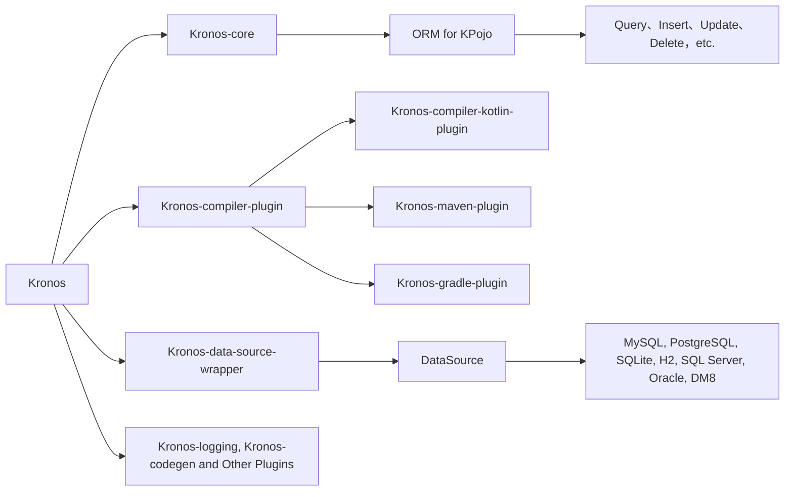


{{ NgDocActions.demo("AnimateLogoComponent", {container: false}) }}

# What is Kronos?
Kronos is a modern ORM framework designed for Kotlin. It uses a compiler plugin to provide type-safe SQL DSL support and works with multiple databases.

We support both {{ $.noun("Code First") }} and {{ $.noun("Database First") }} schemas, which provide **auto-creation of database table structures, auto-synchronization, as well as support for table structures, indexes and code generation**.

Kronos analyzes Kotlin expressions and keeps common database operations close to Kotlin syntax. You can use `==`, `>`, `<`, `in`, field references, projection DSL, and table operations without writing string SQL for ordinary CRUD flows.

## Recommended reading path

New users should start with {{ $.keyword("getting-started/installation", ["Installation"]) }}, then follow {{ $.keyword("getting-started/first-query", ["First Query"]) }} for the smallest model, table creation, insert, and select flow. After that, read {{ $.keyword("mapping/kpojo", ["KPojo"]) }} for entity mapping, {{ $.keyword("query/select", ["Select"]) }} for reads, {{ $.keyword("mutation/insert", ["Insert"]) }} for writes, and {{ $.keyword("database/connect-to-db", ["Connect to DB"]) }} for production data source setup.



# Why Kronos?

* Utilizes the **entire ecosystem and resources** of the JVM platform, such as **database drivers and logging frameworks**, with potential future support for Kotlin Multiplatform.
* **Powered by Kotlin compiler plugins and coroutines**, with **NO reflection** used, Kronos delivers unmatched **high-performance** database operations.
* Supports most **mainstream databases** and allows **freely adding database extensions through plugins**.
* **Concise and expressive writing, supporting Kotlin native syntax** `==`, `>`, `<`, `in`, etc., instead of .eq, .gt, .lt, etc.
* Strong type checking.
* Supports **transactions**, **complex cascading operations without foreign keys (one-to-one, one-to-many, many-to-many)**, **serialization and deserialization**, **cross-database queries**, and **database table/index/remarks creation and structure synchronization**, etc.
* Supports **Logical Deletion**, **Optimistic Lock**, **Creation Time**, **Update Time**, and offers flexible customization settings.
* **Easily integrate with third-party frameworks** such as `Spring`, `Ktor`, `Vert.x`, and `Solon`. See the sample projects for framework-specific usage.
* **Native SQL database manipulation based on named parameters**.
* Supports easy conversion of **data entity classes to Map or from Map to data entity classes** via compile-time operations with **NO reflection, near-zero overhead**.
* Data classes can be treated as database table models, **significantly reducing additional class definitions**.

# Simple examples

> **Note**
> Here is a simple example.

```kotlin name="demo" icon="kotlin"
import com.kotlinorm.Kronos
import com.kotlinorm.wrappers.KronosJdbcWrapper
import org.apache.commons.dbcp2.BasicDataSource

val wrapper = KronosJdbcWrapper(
    BasicDataSource().apply {
        driverClassName = "com.mysql.cj.jdbc.Driver"
        url = "jdbc:mysql://localhost:3306/kronos?useUnicode=true&characterEncoding=utf-8&useSSL=false&serverTimezone=UTC"
        username = "user"
        password = "******"
    }
)

Kronos.dataSource = { wrapper }

// Create a User object
val user: User = User(
    id = 1,
    name = "Kronos",
    age = 18
)

// Create the table if it does not exist, otherwise synchronize columns and indexes.
wrapper.table.syncTable(user)

// Insert data
user.insert().execute()

// Update the name field according to the id.
user.update().set { it.name = "Kronos ORM" }.by { it.id }.execute()
// or
user.update { it.name }.by { it.id }.execute()

// Query records based on object value
val selectedUser: User = user.select().by { it.id }.first()

// Query name field by id
val selectedName: String = user.select { it.name }.where { it.id == 1 }.first<String>()

// Delete data with id 1
User().delete().where { it.id == 1 }.execute()
// or
User(id = 1).delete().by { it.id }.execute()
```

{{ NgDocActions.demo("FeatureCardsComponent", {container: false}) }}
