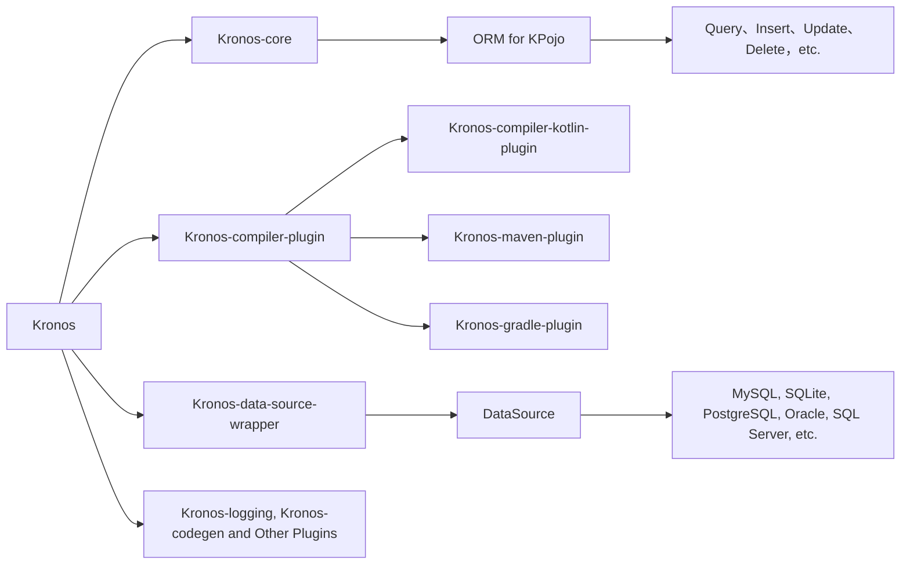


{{ NgDocActions.demo("AnimateLogoComponent", {container: false}) }}

# 什么是Kronos
Kronos 是为 Kotlin 设计的现代 ORM 框架。它通过编译插件提供类型安全的 SQL DSL，并支持多种数据库。

我们支持{{ $.noun("Code First") }}和{{ $.noun("Database First") }}两种模式，提供了**数据库表结构的自动创建、自动同步，以及对表结构、索引**和代码生成的支持。

Kronos 会分析 Kotlin 表达式，并让常见数据库操作保持接近 Kotlin 语法。普通 CRUD 流程可以使用 `==`、`>`、`<`、`in`、字段引用、投影 DSL 和表操作，不需要手写字符串 SQL。

## 推荐阅读路径

新读者先从 {{ $.keyword("getting-started/installation", ["安装"]) }} 开始，再按 {{ $.keyword("getting-started/first-query", ["第一条查询"]) }} 完成最小模型、建表、insert 和 select 流程。之后阅读 {{ $.keyword("mapping/kpojo", ["KPojo"]) }} 理解实体映射，阅读 {{ $.keyword("query/select", ["Select"]) }} 理解查询，阅读 {{ $.keyword("mutation/insert", ["Insert"]) }} 理解写入，最后用 {{ $.keyword("database/connect-to-db", ["连接数据库"]) }} 配置生产数据源。



# 为什么使用Kronos

* 可以使用jvm平台的**全部生态和资源**，如**数据库驱动和日志框架**等，未来可能支持kotlin多平台
* **Kotlin 编译器插件** 和 **协程**驱动，**完全不依赖反射**，Kronos 为用户提供 **超高性能** 的数据库操作体验。
* 支持大多数**主流数据库**且支持自由地通过插件**添加数据库扩展**
* **书写简洁、富有表现力，支持 Kotlin 原生语法** `==`、`>`、`<`、`in` 等，而不是 .eq、.gt、.lt 等
* 强类型检查
* 支持**事务**、**无外键复杂级联操作（一对一，一对多，多对多）**、**序列化反序列化**、**跨数据库查询**、**数据库表/索引/备注创建和结构同步**等功能
* 支持**逻辑删除**、**乐观锁**、**创建时间**、**更新时间**，且支持灵活的自定义设置
* 轻松与第三方框架集成，如`Spring`、`Ktor`、`Vert.x`、`Solon`等；具体用法见示例项目
* **基于命名参数的原生SQL数据库操作**
* 通过编译期操作，支持轻松将**数据实体类转换为Map或从Map转换为数据实体类**，并且**无反射，近乎零开销**
* 数据类就可以当作数据库表模型，**显著减少额外的类定义**

# 示例
> **Note**
> 以下是一个简单的示例。

```kotlin name="demo" icon="kotlin"
import com.kotlinorm.Kronos
import com.kotlinorm.wrappers.KronosJdbcWrapper
import org.apache.commons.dbcp2.BasicDataSource

val wrapper = KronosJdbcWrapper(
    BasicDataSource().apply {
        driverClassName = "com.mysql.cj.jdbc.Driver"
        url = "jdbc:mysql://localhost:3306/kronos?useUnicode=true&characterEncoding=utf-8&useSSL=false&serverTimezone=UTC"
        username = "user"
        password = "******"
    }
)

with(Kronos) {
    dataSource = { wrapper }
}

// 创建一个User对象
val user: User = User(
    id = 1,
    name = "Kronos",
    age = 18
)

// 如果表不存在则创建表，否则同步列和索引
wrapper.table.syncTable(user)

// 插入数据
user.insert().execute()

// 根据id更新name字段
user.update().set { it.name = "Kronos ORM" }.by { it.id }.execute()
// 或
user.update { it.name }.by { it.id }.execute()

// 根据对象值查询记录
val selectedUser: User = user.select().by { it.id }.first()

// 根据id查询name字段
val selectedName: String = user.select { it.name }.where { it.id == 1 }.first<String>()

// 删除id为1的数据
User().delete().where { it.id == 1 }.execute()
// 或
User(id = 1).delete().by { it.id }.execute()
```

{{ NgDocActions.demo("FeatureCardsComponent", {container: false}) }}
