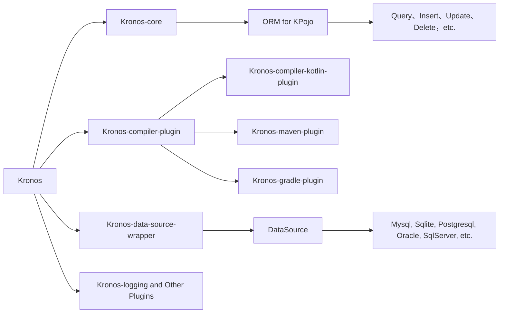


{{ NgDocActions.demo("AnimateLogoComponent", {container: false}) }}

# What is Kronos?
Kronos is a modern ORM framework designed for Kotlin based on the compiler plugin, which is suitable for both backend and mobile applications, support multi-database. Powerful, high performance, easy to use.

We support both {{ $.noun("Code First") }} and {{ $.noun("Database First") }} schemas, which provide **auto-creation of database table structures, auto-synchronization, as well as support for table structures, indexes and code generation**.

KCP implementation of the expression tree analysis support as well as Kotlin itself generic, higher-order functions, extended functions and other syntactic features, so that Kronos has powerful expressive power and concise , semantic writing to make the operation of the database has become more simple.



# Why Kronos?

* Utilizes the **entire ecosystem and resources** of the JVM platform, such as **database drivers and logging frameworks**, with potential future support for Kotlin Multiplatform.
* **Powered by Kotlin compiler plugins and coroutines**, with **NO reflection** used, Kronos delivers unmatched **high-performance** database operations.
* Supports most **mainstream databases** and allows **freely adding database extensions through plugins**.
* **Concise and expressive writing, supporting Kotlin native syntax** `==`, `>`, `<`, `in`, etc., instead of .eq, .gt, .lt, etc.
* Strong type checking.
* Supports **transactions**, **complex cascading operations without foreign keys (one-to-one, one-to-many, many-to-many)**, **serialization and deserialization**, **cross-database queries**, and **database table/index/remarks creation and structure synchronization**, etc.
* Supports **Logical Deletion**, **Optimistic Lock**, **Creation Time**, **Update Time**, and offers flexible customization settings.
* **Easily integrate with any third-party framework** such as `Spring`, `Ktor`, `Vert.x`, `Solon`, etc. See more information in the sample projects plz.
* **Native SQL database manipulation based on named parameters**.
* Supports easy conversion of **data entity classes to Map or from Map to data entity classes** via compile-time operations with **NO reflection, near-zero overhead**.
* Data classes can be treated as database table models, **significantly reducing additional class definitions**.

# Simple examples

> **Note**
> Here is a simple example.

```kotlin name="demo" icon="kotlin"
val wrapper = KronosBasicWrapper(
    MysqlDataSource("jdbc:mysql://localhost:3306/test")
)

Kronos.init {
    dataSource = { wrapper }
}

// Create a User object
val user: User = User(
    id = 1,
    name = "Kronos",
    age = 18
)

// Create the table if it does not exist, otherwise synchronize the table structure, including table columns, indexes, notes, etc.
dataSource.table.syncTable(user)

// Insert data
user.insert().execute()

// Update the name field according to the id.
user.update().set { it.name = "Kronos ORM" }.by{ it.id }.execute()
// or
user.update{ it.name }.by{ it.id }.execute()

// Dynamically query records based on object value
val name: User = user.select().queryOne()

// Query name field by id
val name: String = user.select{ it.name }.where{ it.id == 1 }.queryOne<String>()

// Delete data with id 1
User().delete().where{ it.id == 1 }.execute()
// or
User(1).delete().execute()
```

{{ NgDocActions.demo("FeatureCardsComponent", {container: false}) }}
