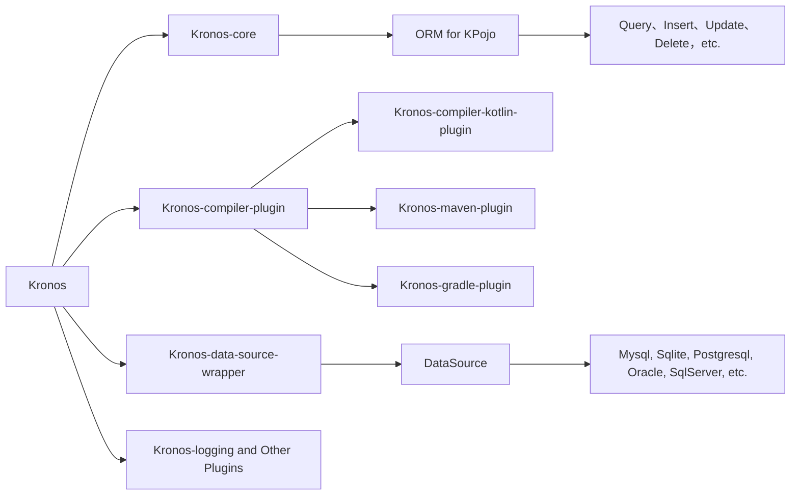


{{ NgDocActions.demo("AnimateLogoComponent", {container: false}) }}

# What is Kronos

Kronos is a modern **ORM** framework for kotlin based on the {{ $.noun("Code First") }} pattern, KCP (**Compiler Plugin**), which supports both **JVM** and **Android** platforms.



# Why use Kronos

**Kronos** developed for Kotlin, with the expression tree parsing support implemented in KCP and kotlin's generics and
higher-order functions, Kronos provides **super-expressive, concise, and semantic** writing that makes manipulating
databases much easier.
Based on the Code First philosophy, we provide **automatic creation of database table structures, automatic
synchronization, and support for table structures, indexes** and other operations.
At the same time through the compiler plug-in , we realized to provide a reflection-free Pojo and Map interconversion
scheme.

*Kronos* cascade operations , cross-table cross-library query greatly improves the development efficiency , and based on
the kotlin co-processing mechanism greatly improves the high concurrency performance .

# Simple examples

> **Note**
> Here is a simple example.

```kotlin name="demo" icon="kotlin"
// Create a User object
val user: User = User(
    id = 1,
    name = "Kronos",
    age = 18
)

// Create the table if it does not exist, otherwise synchronize the table structure, including table columns, indexes, notes, etc.
dataSource.table.sync(user)

// insert data
user.insert().execute()

// Update name field based on id
user.update().set { it.name = "Kronos ORM" }.by { it.id }.execute()

// Query name field by id
val name: String = user.select { it.name }.where { it.id == 1 }.queryOne<String>()

// Delete data with id 1
User().delete().where { it.id == 1 }.execute()
```

{{ NgDocActions.demo("FeatureCardsComponent", {container: false}) }}
