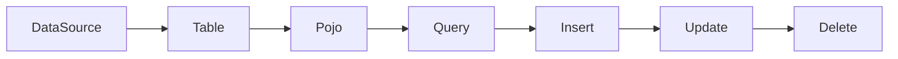

# {{ NgDocPage.title }}

----

{{ NgDocActions.demo("AnimateLogoComponent", {container: false}) }}

Kronos是一款基于**Code First**模式、KCP（**编译器插件**），为kotlin设计的现代化的**ORM**框架。



*Kronos*为Kotlin而开发，通过KCP实现的表达式树分析支持以及kotlin的泛型和高阶函数，Kronos提供了**超级富有表现力、简洁而又语义化**的写法，使操作数据库变得更加简单。

基于Code First的理念，我们提供了**数据库表结构的自动创建、自动同步，以及对表结构、索引**等操作的支持。

同时通过编译器插件，我们实现了提供了无反射的Pojo和Map互转方案。

*Kronos*的级联操作、跨表跨库查询大大提升了开发效率，并基于kotlin协程机制大大提高了高并发性能。

> **Note**
> 以下是一个简单的示例。

```kotlin name="demo" icon="kotlin"
 // 如果表不存在则创建表，否则同步表
if(!dataSource.table.exsits<User>()){
    dataSource.table.create<User>()
} else{
    dataSource.table.sync<User>()
}

// 创建一个User对象
val user: User = User(
    id = 1,
    name = "Kronos",
    age = 18
)

// 插入数据
user.insert().execute()

// 根据id更新name字段
user.update().set { it.name = "Kronos ORM" }.by{ it.id }.execute()

// 根据id查询name字段
val name: String = user.select{ it.name }.where { it.id == 1 }.queryOne<String>()

// 删除id为1的数据
User().delete().where { it.id == 1 }.execute()
```

{{ NgDocActions.demo("FeatureCardsComponent", {container: false}) }}
